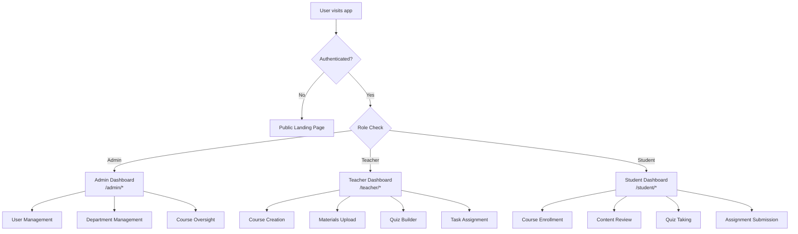
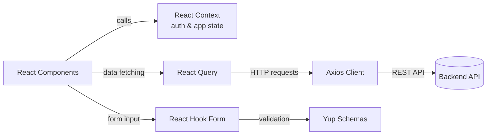

# 🎓 Campus AI

**A role-based educational dashboard for administrators, teachers, and students**

---

## 📌 Overview

**New Campus AI** is a modern, role-based campus management platform built to streamline the workflow between administrators, teachers, and students. Each role gets a dedicated dashboard with tailored permissions, views, and tools — powered by a clean, type-safe React + TypeScript architecture.

| Role | Capabilities |
|------|-------------|
| 🛡️ **Admin** | Manage users, departments, courses, and overall system access |
| 👩‍🏫 **Teacher** | Create courses, upload materials, build quizzes, assign tasks |
| 🎓 **Student** | Enroll in courses, review content, take quizzes, submit assignments |

---

## 🏗️ System Architecture



## 🔄 Request & State Flow



---

## ✨ Features

- 🔐 Role-based authentication with protected routes
- 🛡️ Admin dashboard — user & department management
- 👩‍🏫 Teacher dashboard — courses, materials, quizzes, tasks
- 🎓 Student dashboard — enrollment, content, quizzes, submissions
- 📱 Fully responsive UI with reusable components & skeleton loaders
- 🔗 Centralized API integration via Axios + React Query
- 🌍 Shared state management via React Context

---

## 🛠️ Technology Stack

| Category | Tools |
|----------|-------|
| **Core** | React 19, TypeScript 6, Vite |
| **Styling** | Tailwind CSS 4, Material UI |
| **Routing** | React Router DOM 7 |
| **Data Fetching** | React Query, Axios |
| **Forms & Validation** | React Hook Form, Yup |
| **Code Quality** | ESLint |

---

## 📂 Repo Structure

```
src/
├── Components/   # Reusable components, UI widgets, skeleton loaders
├── Layouts/      # Layout wrappers for admin, teacher, and student pages
├── Pages/        # Feature pages and views for each role
├── routes/       # Route definitions for admin, teacher, and student sections
├── context/      # Auth and application state providers
├── lib/          # API client modules
├── schema/       # Validation schemas and shared data definitions
├── Services/     # Utilities for cookies and profile handling
└── utils/        # Helper utilities
```

---

## 🚀 Getting Started

### Prerequisites
- Node.js v20 or later
- npm v10 or later

### Installation

```bash
# Install dependencies
npm install

# Start development server
npm run dev

# Build for production
npm run build

# Preview production build
npm run preview
```

### Available Scripts

| Command | Description |
|---------|-------------|
| `npm run dev` | Start application in development mode |
| `npm run build` | Compile and bundle application |
| `npm run preview` | Preview the production build locally |
| `npm run lint` | Run ESLint checks |

---

## 📝 Notes

- Public landing page is shown when users are not authenticated.
- Authenticated users are redirected to the correct dashboard based on role.
- Route structure:
  - Admin → `/admin/*`
  - Teacher → `/teacher/*`
  - Student → `/student/*`